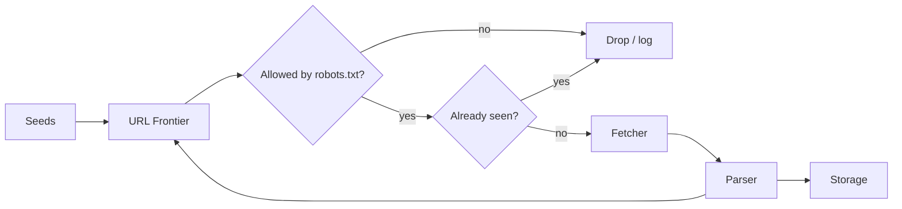

# Building a Good Web Crawler

Reference guide for **Zcrawler** and future crawler work. This document synthesizes widely accepted system-design practice, [RFC 9309](https://www.rfc-editor.org/rfc/rfc9309.html) (Robots Exclusion Protocol), and production lessons from large-scale crawlers (Mercator, UbiCrawler, Common Crawl, Frontera, Scrapy).

---

## Table of contents

1. [What a crawler is](#1-what-a-crawler-is)
2. [Core architecture](#2-core-architecture)
3. [URL frontier and scheduling](#3-url-frontier-and-scheduling)
4. [Politeness and robots.txt](#4-politeness-and-robotstxt)
5. [Deduplication](#5-deduplication)
6. [Fetching and HTTP behavior](#6-fetching-and-http-behavior)
7. [Parsing and link discovery](#7-parsing-and-link-discovery)
8. [Storage and data model](#8-storage-and-data-model)
9. [Scaling patterns](#9-scaling-patterns)
10. [Ethics, legal, and trust](#10-ethics-legal-and-trust)
11. [Reliability, traps, and safety](#11-reliability-traps-and-safety)
12. [Observability and logging](#12-observability-and-logging)
13. [Implementation ladder](#13-implementation-ladder)
14. [Zcrawler checklist](#14-zcrawler-checklist)
15. [Further reading](#15-further-reading)

---

## 1. What a crawler is

A web crawler is a **closed-loop pipeline**:

```
Seeds → Frontier (what to fetch) → Fetch → Parse → Store
                              ↑                    |
                              └── new URLs ────────┘
```

State lives in two places:

| State | Purpose |
|--------|---------|
| **URL frontier** | Ordered queue of work: what to fetch next, with priority and politeness |
| **Dedup substrate** | What has already been seen (URLs and optionally content fingerprints) |

Everything else—HTTP client, HTML parser, JS renderer, object storage—is replaceable plumbing. A good crawler optimizes three tensions:

1. **Throughput** — crawl enough pages to meet your goal.
2. **Politeness** — never overload a single host; respect site policy.
3. **Correctness** — avoid infinite loops, duplicate work, and silent data loss.

---

## 2. Core architecture

### Minimum viable components

| Component | Responsibility |
|-----------|----------------|
| **Seeds** | Initial URLs (and optional sitemap URLs) |
| **Frontier / scheduler** | Enqueue, prioritize, dequeue URLs; enforce per-host delays |
| **Fetcher** | HTTP(S) requests, redirects, timeouts, compression |
| **Robots layer** | Fetch, parse, cache `robots.txt`; allow/deny before fetch |
| **Parser** | Extract links, metadata, and structured fields from responses |
| **Dedup** | URL normalization + membership test; optional content fingerprint |
| **Storage** | Raw HTML, parsed records, crawl metadata (status, timestamps, parent URL) |
| **Coordinator** (optional) | Distributed work assignment, health, metrics |

### Recommended data flow



### Architecture paths (choose by scale)

| Path | When to use | Tradeoff |
|------|-------------|----------|
| **Single process** | Prototypes, &lt; few million pages | Simple; one machine limit |
| **Coordinator + workers** | Medium scale (Redis/SQLite frontier) | Central bottleneck unless sharded |
| **Host-partitioned distributed** | Large scale | Linear scaling; politeness per partition |
| **Kafka (or similar) + workers** | Production, replay, fault tolerance | Ops cost; partition count caps parallelism |

**Key insight (UbiCrawler):** shard work by **hostname** (consistent hash). Each worker owns a slice of hosts and can enforce politeness **locally** without global locks.

---

## 3. URL frontier and scheduling

The frontier is more than a FIFO queue. It must handle **priority**, **politeness**, and **freshness**.

### Mercator-style dual queue (reference design)

From the Mercator crawler paper:

- **Front queues** — priority by importance (depth from seed, PageRank-like score, recrawl age, domain trust).
- **Back queues** — one FIFO **per host**; a timer ensures minimum delay between requests to that host.

Selection loop (simplified):

1. Pick a non-empty front queue (weighted by priority).
2. Take a URL from that queue’s associated back queue **only if** that host’s politeness timer has expired.
3. If blocked, try another front queue or wait.

Rule of thumb: maintain roughly **3× back queues per active fetch thread** so threads rarely stall waiting for a ready host.

### URL normalization (before dedup)

Normalize every URL **before** adding to frontier or dedup set. Goal: fewer false negatives (treating the same page as different URLs).

Apply consistently (RFC 3986–based rules):

| Step | Example |
|------|---------|
| Resolve relative links against base URL | `/a` + base → full URL |
| Lowercase scheme and host | `HTTP://Example.COM` → `http://example.com` |
| Remove default ports | `:443` on `https` |
| Remove fragment (`#...`) | Usually not sent to server for dedup |
| Normalize path | Collapse `//`, resolve `.` and `..` |
| Sort query parameters (optional) | `?b=1&a=2` → `?a=2&b=1` |
| Strip tracking params (optional, site-specific) | `utm_*`, `fbclid` |
| Punycode / IDNA for international domains | Consistent host form |

**Caution:** Over-aggressive normalization causes false positives (skipping distinct pages). Start conservative; add site-specific rewrite rules only with evidence from crawl logs.

### Priority signals

Useful heuristics (combine with weights):

- **Depth** — BFS from seeds; cap max depth per host.
- **Freshness** — `Last-Modified`, `ETag`, or time since last crawl for recrawl.
- **Importance** — inbound link count, sitemap `priority`, manual seed boost.
- **Robots / policy** — deprioritize or skip disallowed paths early.

### Recrawl

For monitoring or search-index style crawls, store **last crawl time** and **change signals** per URL. Schedule recrawls with exponential spacing unless the site is high-churn.

---

## 4. Politeness and robots.txt

### Why politeness matters

Aggressive crawlers get **blocked**, poison your data, and can cause legal or operational harm. A crawler that runs slowly for months beats one banned in an hour.

### Per-host rate limiting

- Default floor: **≥ 1 second** between requests to the same host (adjust down only for explicit permission or your own infrastructure).
- **Adaptive backoff:** if latency rises or 429/503 rates increase, increase delay automatically.
- **Shared state in distributed crawls:** per-host last-request time in Redis or local memory on the partition owner.

Algorithms: token bucket or leaky bucket per host; respect `Retry-After` on 429.

### RFC 9309 (Robots Exclusion Protocol) — treat as a hard contract

Official spec: [RFC 9309](https://www.rfc-editor.org/rfc/rfc9309.html).

| Requirement | Behavior |
|-------------|----------|
| Location | `https://host/robots.txt` at site root (per origin: scheme + host + port) |
| Encoding | UTF-8, `text/plain` |
| Redirects | Follow up to **5** consecutive redirects |
| Parse size | Process at least **500 KiB** of the file |
| Cache | ≤ **24 hours** unless file is unreachable (then prior cache may be reused) |
| User-agent matching | Case-insensitive product token match; merge all matching groups |
| Path rules | Case-sensitive; **longest match wins**; tie → **Allow** wins |
| Implicit allow | `/robots.txt` itself is always allowed |
| HTTP **404** / 4xx (unavailable) | No restrictions — crawling allowed |
| HTTP **5xx** (unreachable) | Treat as **disallow all** until reachable |
| `Crawl-delay` | **Not in RFC 9309**; some engines honor it with different semantics — document your choice |

**Note:** `robots.txt` is **advisory**. It is not access control. Malicious bots ignore it. Do not rely on it for security.

### Implementation checklist for robots layer

- [ ] Fetch robots before first request to a host (or in parallel with first allowed URL).
- [ ] Cache parsed rules with TTL ≤ 24h.
- [ ] Log robots fetch result (status, version, rule count).
- [ ] Support `Allow` / `Disallow` with `*` and `$` (Google-style extensions; common on the web).
- [ ] Re-check robots after cache expiry and on repeated 5xx from host.

### User-Agent

Use a **truthful, stable** User-Agent:

```
Zcrawler/1.0 (+https://your-project.example/contact; contact@example.com)
```

Administrators need a way to reach you. Do not impersonate browsers unless you have a documented reason and accept the trust cost.

---

## 5. Deduplication

Duplicate URLs and near-duplicate content dominate the web. Dedup saves bandwidth, storage, and crawl budget.

### Two layers

| Layer | Mechanism | False positives | False negatives |
|-------|-----------|-----------------|-----------------|
| **URL** | Normalized URL + Bloom filter → persistent store | Bloom: may skip unseen URL (rare) | Must be **zero** for “already crawled” |
| **Content** | SHA-256 exact hash; SimHash / MinHash for near-dup | May merge similar boilerplate | Re-fetch under different URLs |

### Bloom filter sizing (URL seen-set)

Approximate memory for *n* URLs at false-positive rate *p*:

- ~10 bits per URL at 1% FP → ~1.2 GB per billion URLs (order of magnitude).
- On “maybe seen,” confirm against durable store (RocksDB, SQL, S3 index).

### SimHash (near-duplicate content)

- 64-bit fingerprint per page (body text, main content extraction).
- Hamming distance ≤ **3** often used as near-duplicate threshold (validated at Google scale in literature).
- Store fingerprints in a banded index for efficient neighbor lookup.

### When to dedup

| Stage | Action |
|-------|--------|
| Before enqueue | Skip if URL already in frontier or completed |
| After fetch | Skip storage if exact/near content duplicate |
| After parse | Normalize discovered links before enqueue |

---

## 6. Fetching and HTTP behavior

### Request defaults

- **Timeouts:** connect + read (e.g. 10s + 30s); retry transient failures with backoff.
- **Redirects:** cap chain length (e.g. 10); do not follow cross-domain redirects blindly without re-checking robots on new host.
- **Compression:** send `Accept-Encoding: gzip, br`; guard against decompression bombs (max uncompressed size).
- **Conditional requests:** use `If-Modified-Since` / `If-None-Match` on recrawl when you store validators.
- **DNS:** cache resolutions (local resolver or in-process TTL cache) to avoid DNS as bottleneck at scale.

### Status code policy

| Code | Typical action |
|------|----------------|
| 2xx | Parse; store |
| 301/302/307/308 | Follow (within limit); update canonical URL |
| 404 | Mark dead; do not retry aggressively |
| 403/401 | Log; backoff; may be bot block |
| 429 | Honor `Retry-After`; exponential backoff |
| 5xx | Retry with jittered exponential backoff; deprioritize host |

### JavaScript rendering

Default: **static HTML only** (fast, cheap).  
Enable headless browser (Playwright/Puppeteer) only when:

- Target site is a SPA with client-rendered links, and
- You accept ~10–100× cost per page.

Render selectively by domain or content-type heuristics.

### Connection pooling

Reuse TCP/TLS connections per host. Limit concurrent connections per host (often 1–2 for politeness, slightly higher only if robots/policy allows).

---

## 7. Parsing and link discovery

### HTML

- Use a robust parser (e.g. `lxml`, `html5lib`, BeautifulSoup with clear encoding handling).
- Respect `<base href>` for relative URLs.
- Extract: `<a href>`, `<link>`, canonical `<link rel="canonical">`, `meta robots`, JSON-LD if needed.
- Skip: `mailto:`, `javascript:`, data URLs (unless required).

### Other formats

- **Sitemaps** (`sitemap.xml`, index files) — high-quality seed and recrawl source.
- **RSS/Atom** — optional discovery for news crawls.
- **PDF/office** — separate pipeline; often out of scope for generic crawlers.

### Canonicalization at parse time

Prefer canonical URL from page metadata when storing identity, but still normalize for dedup consistently.

---

## 8. Storage and data model

### What to store per URL (minimum)

```text
url_normalized, url_final, host, fetched_at, status_code,
content_type, content_hash, parent_url, depth,
robots_allowed, response_headers (optional subset), body_or_pointer
```

### Storage tiers

| Tier | Contents | Backend examples |
|------|----------|------------------|
| Hot | Frontier, robots cache, rate-limit clocks | Redis, SQLite |
| Warm | Parsed records, metadata | PostgreSQL, DuckDB |
| Cold | Raw HTML, large blobs | Filesystem, S3-compatible object store |

Compress raw HTML (gzip/zstd). At billion-page scale, compression is mandatory for cost.

### Idempotency

Writes should be **idempotent** on `(url_normalized, crawl_generation)` so retries after worker crash do not corrupt state.

---

## 9. Scaling patterns

### Order-of-magnitude planning

Anchor expectations on public benchmarks (e.g. Common Crawl publishes billions of pages per month from tens of millions of hosts). For a **1 billion pages / 30 days** target:

- ~385 pages/sec sustained; plan **3× peak** headroom.
- Single well-tuned machine: often **~100–200 pages/sec** network-bound (depends on page size).
- Average HTML ~50–500 KB drives bandwidth and storage math.

### Distributed sketch (Kafka-style)

1. Discovered URLs published to topic **partitioned by hash(host)**.
2. Each consumer owns partitions → owns politeness for those hosts.
3. Durable log enables replay after bugs or policy changes.
4. Stateless fetch workers + shared dedup store (or partitioned Bloom filters).

### DNS at scale

Run local caching resolver (e.g. dnsmasq) or aggressive in-process cache. Monitor DNS latency as a first-class metric.

---

## 10. Ethics, legal, and trust

**This is not legal advice.** Engineering controls reduce risk and build defensibility.

| Principle | Practice |
|-----------|----------|
| **Purpose limitation** | Crawl only what you need; define scope per project |
| **Public data** | Prefer clearly public pages; avoid bypassing authentication |
| **Terms of service** | Read ToS for target sites; document exceptions |
| **Copyright** | Storing/displaying/redistributing content may have separate rules from fetching |
| **PII** | Minimize collection; define retention and deletion |
| **AI crawlers** | Many sites now block `GPTBot`, `ClaudeBot`, etc. — use distinct user-agents and honor AI-specific rules if applicable |
| **Provenance** | Log which policy version allowed each fetch (robots snapshot hash, timestamp) |

`robots.txt` compliance is necessary for **reputation and interoperability**; it does not automatically make a crawl lawful in every jurisdiction.

---

## 11. Reliability, traps, and safety

### Spider traps

Sites can generate infinite URLs (calendars, faceted search, session IDs).

| Defense | Implementation |
|---------|----------------|
| Max depth per host | Stop enqueue beyond N hops from seed |
| Max URLs per host | Cap during single crawl run |
| Pattern detection | Detect repeating path segments (`/page/1`, `/page/2`, …) |
| URL length / param count limits | Drop absurd URLs |
| Robots + disallow query explosions | Block known trap patterns |

### Circuit breaker per host

After K consecutive failures or timeouts, pause that host for a cooling period.

### Security

- Do not execute arbitrary JavaScript from untrusted pages in the same context as credentials.
- Sanitize stored HTML if later rendered in an admin UI.
- `robots.txt` must not be treated as a secret path list (attackers use it as a hint).

---

## 12. Observability and logging

Production crawlers are debugged from logs and metrics, not from printf in a spider callback.

### Structured logs (rotate files)

Use rotating log files (e.g. `logs/zcrawler.log`, `logs/errors.log`) with:

- ISO timestamp, level, host, url (truncated), status, duration_ms, worker_id
- **Decision logs:** robots allow/deny, dedup hit/miss, retry reason
- **Policy logs:** robots cache hit, crawl-delay applied, backoff step

### Metrics (_counters / histograms)

| Metric | Why |
|--------|-----|
| Pages fetched / sec | Throughput |
| Per-host request rate | Politeness verification |
| Status code distribution | Block detection |
| Fetch latency p50/p95 | Adaptive rate tuning |
| Frontier depth | Stuck crawl detection |
| Dedup hit rate | Efficiency |
| Robots 5xx rate | Policy safety |

### Tracing a single URL

You should be able to answer: *Why was this URL skipped or fetched twice?* from logs + DB row.

---

## 13. Implementation ladder

Build in stages; do not jump to Kafka on day one.

### Stage 1 — Single-machine prototype

- List of seeds, in-memory or SQLite frontier
- `urllib` / `httpx` / `requests` with delays
- `robotparser` extended for RFC 9309 edge cases (or dedicated library)
- Write HTML to disk; CSV/JSON metadata

### Stage 2 — Framework-based (recommended for Zcrawler)

**[Scrapy](https://docs.scrapy.org/)** (Python, free, async):

| Piece | Scrapy component |
|-------|------------------|
| Scheduler | Engine + scheduler |
| Fetch | Downloader + download handlers |
| Politeness | `DOWNLOAD_DELAY`, `AUTOTHROTTLE`, per-domain concurrency |
| Middleware | Downloader middleware (proxies, retries, robots) |
| Parse | Spider callbacks |
| Pipeline | Item pipelines → DB/files |

Key settings to tune early: `CONCURRENT_REQUESTS_PER_DOMAIN`, `DOWNLOAD_DELAY`, `ROBOTSTXT_OBEY`, `RETRY_TIMES`, `AUTOTHROTTLE_*`.

Alternatives: **colly** (Go), **Apache Nutch** (Java, heavy), custom **httpx + asyncio** queue.

### Stage 3 — Distributed

- Redis or Kafka frontier
- Host-partitioned workers
- Central dedup (Bloom + store)
- Object storage for bodies

---

## 14. Zcrawler checklist

Use this before calling a crawl “production-ready.”

### Policy and ethics

- [ ] Documented crawl scope and retention policy
- [ ] Identifying User-Agent with contact URL/email
- [ ] RFC 9309–compliant robots parser and cache (≤ 24h)
- [ ] Per-host rate limit with adaptive backoff on 429/5xx

### Correctness

- [ ] URL normalization applied before dedup and enqueue
- [ ] URL dedup with durable backing store (not Bloom-only)
- [ ] Max depth / max URLs per host / trap heuristics
- [ ] Redirect limit and robots re-check on cross-origin redirect

### Operations

- [ ] Rotating structured logs + error log
- [ ] Metrics or periodic summary stats in logs
- [ ] Graceful shutdown (flush frontier, finish in-flight)
- [ ] Idempotent storage writes for retries

### Data

- [ ] Store final URL, status, timestamps, parent URL, content hash
- [ ] Compression for raw bodies
- [ ] Config via env/file (no secrets in repo)

---

## 15. Further reading

| Resource | Topic |
|----------|--------|
| [RFC 9309](https://www.rfc-editor.org/rfc/rfc9309.html) | Robots Exclusion Protocol (authoritative) |
| [RFC 3986](https://www.rfc-editor.org/rfc/rfc3986.html) | URI generic syntax (normalization) |
| Mercator / UbiCrawler papers | Frontier design, distributed politeness |
| [Scrapy architecture](https://docs.scrapy.org/en/stable/topics/architecture.html) | Component model for Python crawlers |
| [Common Crawl](https://commoncrawl.org/) | Real-world crawl scale reference |
| [Sujeet Jaiswal — Design a Web Crawler](https://sujeet.pro/articles/design-web-crawler) | Modern production-shaped design walkthrough |

---

*Last updated: 2026-05-27 — maintained as the canonical crawler design reference for Zcrawler.*
